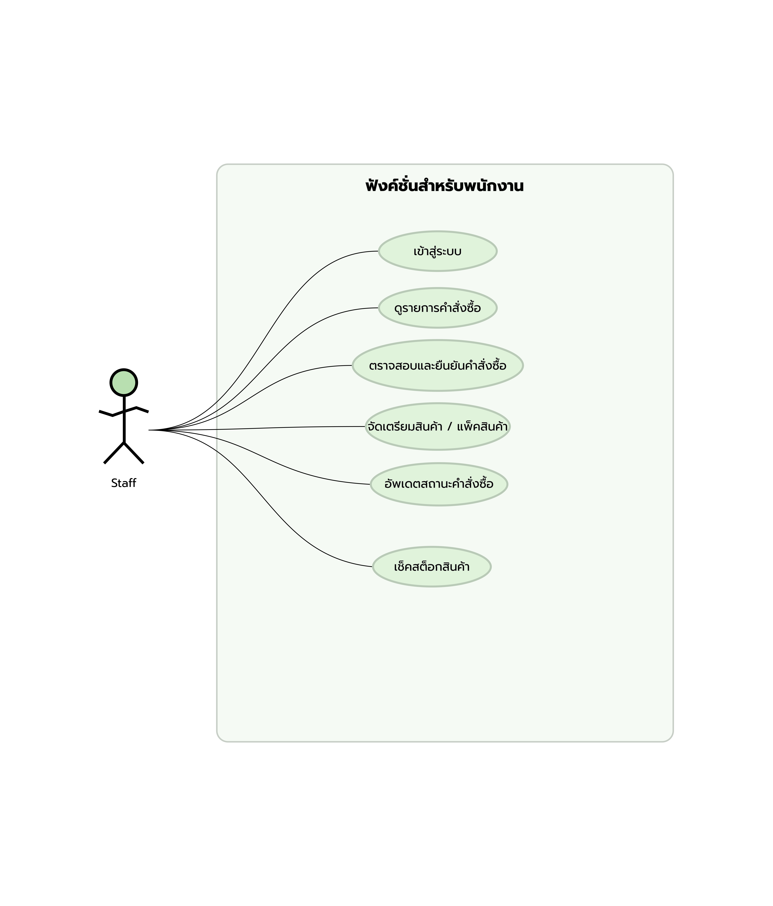
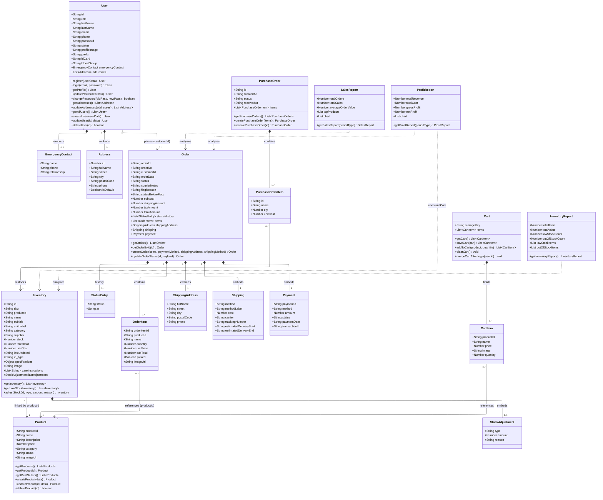
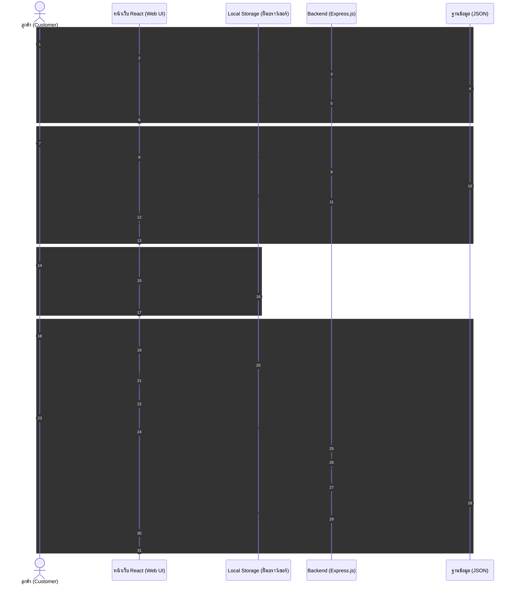
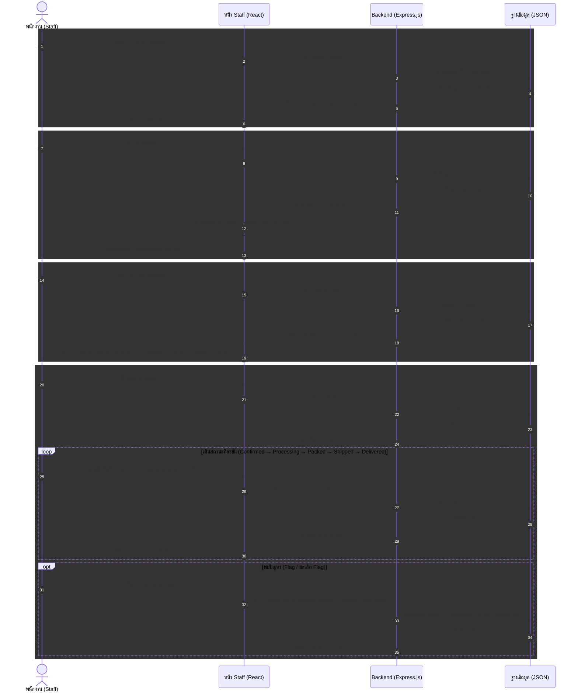
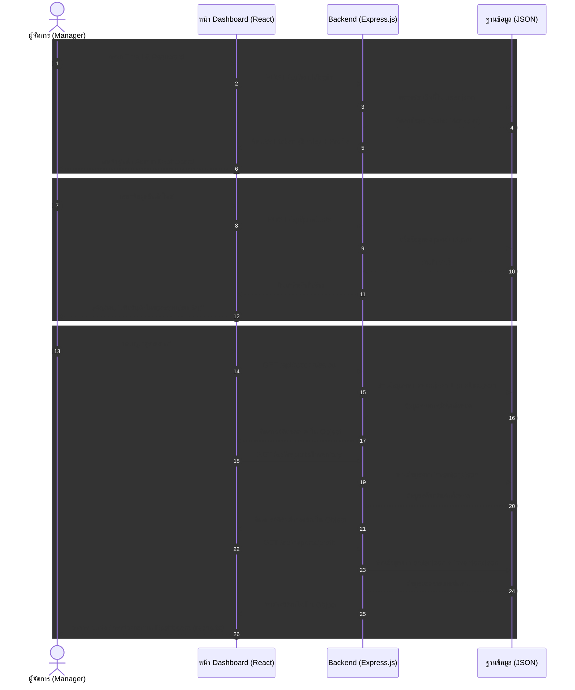
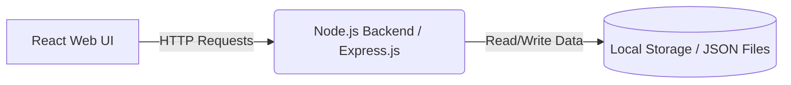

# PetStop (เพ็ทสต็อป)
**Domain:** e-Commerce (ระบบร้านค้าออนไลน์สำหรับสัตว์เลี้ยงแบบครบวงจร)

## 📑 สารบัญ (Table of Contents)
1. [สมาชิกในกลุ่ม (Group Members)](#group-members)
2. [หลักการและเหตุผล (Rationale)](#rationale)
3. [วัตถุประสงค์ของโครงงาน (Objectives)](#objectives)
4. [ขอบเขตของระบบ (System Scope)](#system-scope)
5. [แนวทางของการพัฒนาตาม SDLC (System Development Life Cycle)](#system-development-life-cycle)
6. [User Personas (กลุ่มผู้ใช้งานเป้าหมาย)](#user-personas)
7. [UI/UX Design & Prototype](#ui-ux)
8. [Tech Stack (เครื่องมือและเทคโนโลยีที่ใช้)](#tech-stack)
9. [แผนการดำเนินงาน (Work Plan)](#work-plan)
10. [Use Case Diagram](#use-case)
11. [Class Diagram](#class-diagram)
12. [Sequence Diagrams](#sequence-diagrams)
13. [System Architecture](#system-architecture)
14. [Wireframe](#wireframe)
15. [Data Schema](#data-schema)
16. [User Acceptance Testing (UAT)](#uat)

---

## <a id="group-members"></a>👥 สมาชิกในกลุ่ม (Group Members)
* **67097950** อนันยศ ชัยชนะ (ปลานัย) - Project Manager, Infrastructure
* **67107433** ณัชพล วงศาจันทร์ (นอร์ท) - Frontend, Backend
* **67115588** ธนกฤต เพ็ชรกำจัด (บอน) - Frontend, Backend

---

## <a id="rationale"></a>💡 หลักการและเหตุผล (Rationale)
ในปัจจุบัน ผู้คนนิยมเลี้ยงสัตว์เลี้ยงเพื่อเป็นเพื่อนคลายเหงามากขึ้น อย่างไรก็ตามผู้เลี้ยงสัตว์จำนวนมากมักประสบปัญหาข้อจำกัดด้านเวลาในการเดินทางไปซื้อสินค้าที่ร้านค้าโดยตรง หรือร้านค้าในพื้นที่อาจมีสินค้าไม่ครอบคลุมความต้องการ จากปัญหาดังกล่าว จึงมีแนวคิดที่จะพัฒนาเว็บไซต์สำหรับสินค้าพื้นฐานแบบครบวงจร

---

## <a id="objectives"></a>🎯 วัตถุประสงค์ของโครงงาน (Objectives)
1. เพื่อพัฒนาเว็บไซต์ที่เป็นศูนย์รวมสินค้าและอุปกรณ์สำหรับสัตว์เลี้ยงครบวงจร
2. เพื่อพัฒนาระบบจัดการข้อมูลสินค้าและระบบค้นหาที่ช่วยให้ผู้ใช้งานสามารถหาสินค้าที่ต้องการได้อย่างรวดเร็ว
3. เพื่ออำนวยความสะดวกและเพิ่มช่องทางในการเลือกสินค้าสำหรับสัตว์เลี้ยงให้แก่ผู้บริโภค

---

## <a id="system-scope"></a>⚙️ ขอบเขตของระบบ (System Scope)

### ผู้ใช้งาน (Actors)
* ลูกค้า (Customer)
* พนักงาน (Staff)
* ผู้จัดการ (Manager / Admin)

### ความสามารถหลักของระบบ (Main Functions)
1. การจัดการสมาชิก (Register / Login)
2. การจัดการข้อมูลสินค้า (Product Management)
3. การค้นหาและแสดงรายละเอียดสินค้า (Search & View Products)
4. ระบบตะกร้าสินค้า (Shopping Cart)
5. ระบบสั่งซื้อสินค้า (Order Management)
6. ระบบชำระเงิน (Simulation หรือ Mockup ได้)
7. ระบบติดตามสถานะคำสั่งซื้อ 
8. ระบบจัดการสินค้าและคำสั่งซื้อสำหรับผู้ดูแลระบบ
9. รานงานหรือ Dashboard สรุปข้อมูลเบื้องต้น

---

## <a id="system-development-life-cycle"></a>🧑‍💻 แนวทางของการพัฒนาตาม SDLC (System Development Life Cycle)

| ขั้นตอน (Phase) | รายละเอียดโดยย่อ (Brief Description) |
| :--- | :--- |
| **1. Planning** | กำหนดเป้าหมาย ขอบเขตการทำงานของเว็บ วางแผนระยะเวลา และแบ่งหน้าที่ในทีม |
| **2. Analysis** | วิเคราะห์ความต้องการโดยอิงจาก Persona, Usecase & Class Diagram |
| **3. Design** | ออกแบบ Frontend ด้วย Figma ออกแบบ Backend ด้วย System Architecture |
| **4. Development** | เขียนโค้ดสร้างระบบ ฐานข้อมูล ตามที่วิเคราะห์ |
| **5. Testing** | ทดสอบเครื่องมือต่างๆ และ ทดสอบด้วยมือ(UAT) |
| **6. Deployment** | นำโค้ดขึ้น Production เพื่อเปิดให้ผู้ใช้งานจริงสามารถเข้าถึงได้ |
| **7. Maintenance** | ติดตามดูแลระบบ แก้ไขปัญหาที่เกิดขึ้นหลังจากการเปิดใช้งาน |

---

## <a id="user-personas"></a>🧑‍🤝‍🧑 User Personas (กลุ่มผู้ใช้งานเป้าหมาย)

### 1. ลูกค้า (Customer) - คุณ มิยาบิ 
* **อายุ:** 32 ปี | **อาชีพ:** พนักงานบริษัท | **รายได้:** 35,000 บาท/เดือน
* **ความสนใจ:** สุขภาพสัตว์เลี้ยง, ของเล่นและเสื้อผ้าตามเทรนด์, ความสะดวกสบายในการช้อปปิ้ง
* **เป้าหมาย:** ต้องการซื้อของให้สัตว์เลี้ยงครบจบในเว็บเดียว และสามารถค้นหาสินค้าที่ตรงกับความต้องการได้อย่างรวดเร็วผ่านตัวกรอง ราคา, ประเภท และสินค้าขายดี
* **ความต้องการ:** ระบบค้นหาสินค้าที่แม่นยำและแสดงรายละเอียดสินค้าชัดเจน, ช่องทางการชำระเงินที่สะดวกรองรับทั้งระบบออนไลน์ (Credit card / PromptPay),  สามารถติดตามสถานะคำสั่งซื้อและดูประวัติการสั่งซื้อย้อนหลังได้ด้วยตัวเอง
* **Pain Point:** หาสินค้าเฉพาะเจาะจงยาก เสียเวลาเข้าหลายเว็บ, ไม่มั่นใจรายละเอียดสินค้าก่อนซื้อ, และเว็บทั่วไปมักมีช่องทางการชำระเงินที่จำกัดหรือยุ่งยาก

### 2. พนักงาน (Staff) - คุณ ชาย
* **อายุ:** 25 ปี | **อาชีพ:** พนักงานรับออเดอร์ | **รายได้:** 23,000 บาท/เดือน
* **ความสนใจ:** ารจัดระเบียบสินค้า, การบริการลูกค้า, ความรวดเร็วในการทำงาน
* **เป้าหมาย:** จัดเตรียมสินค้าและแพ็กตามออเดอร์ได้อย่างถูกต้อง รวดเร็ว พร้อมทั้งอัปเดตสถานะให้ลูกค้าทราบได้ทันที
* **ความต้องการ:** ระบบที่สามารถดึงรายการออเดอร์ทั้งหมดมาดูเพื่อตรวจสอบและยืนยันคำสั่งซื้อได้ง่าย, สามารถกดยืนยันการอัปเดตสถานะเป็น "จัดส่งแล้ว" เข้าสู่ระบบฐานข้อมูล (orders.json) ได้ทันที, ระบบตรวจสอบและปรับปรุงสต็อก ที่ใช้งานง่ายและอัปเดตจำนวนสินค้าลงฐานข้อมูลได้รวดเร็ว
* **Pain Point:** ลูกค้าสั่งของที่หมดไปแล้วเพราะระบบตัดสต็อกไม่ทัน, สับสนกับรายการออเดอร์ที่ต้องจัดส่งเพราะไม่มีระบบจัดการสถานะที่ชัดเจน

### 3. ผู้จัดการ (Admin) - คุณ เดโช
* **อายุ:** 45 ปี | **อาชีพ:** เจ้าของร้าน All-in-one Pet Store | **รายได้:** 50,000 บาท/เดือน
* **ความสนใจ:** การบริหารคลังสินค้า, การวิเคราะห์ยอดขายเพื่อทำกำไร, พฤติกรรมคนรักสัตว์
* **เป้าหมาย:** บริหารจัดการสต็อกให้มีประสิทธิภาพสูงสุด และวิเคราะห์ข้อมูลภาพรวมของร้านเพื่อประกอบการตัดสินใจทางธุรกิจ
* **ความต้องการ:** หน้า Dashboard ที่แสดงภาพรวมทั้งหมด เช่น ยอดขายรวม, สินค้าขายดี, คำสั่งซื้อรอจัดส่ง และแจ้งเตือนสินค้าสต็อกใกล้หมด, ระบบจัดการแคตตาล็อกสินค้าที่สามารถ เพิ่ม แก้ไข และลบข้อมูลหมวดหมู่หรือตัวสินค้าได้ด้วยตนเอง, ระบบที่สามารถดึงข้อมูลมาสร้างรายงาน ทั้งรายงานยอดขาย (รายวัน/รายเดือน/รายไตรมาส), รายงานสินค้าคงเหลือ และรายงานผลประกอบการ โดยแสดงผลเป็นกราฟแท่งหรือกราฟวงกลมบนหน้าเว็บได้
* **Pain Point:** จำนวน SKU สินค้าเยอะมากทำให้คุมสต็อกด้วยมือยากและเกิดข้อผิดพลาด, ขาดข้อมูลสรุปยอดขายและกำไรที่เป็นรูปธรรมทำให้วางแผนธุรกิจได้ลำบาก
---

## <a id="ui-ux"></a>🎨 UI/UX Design & Prototype

### Color Palette (โทนสีที่ใช้)
* 🟩 `#CCD5AE` (สีเขียวอ่อน)
* 🟨 `#E0E5B6` (สีเหลืองมะนาวอ่อน)
* 🟧 `#FAEDCE` (สีครีมอ่อน)
* 🟨 `#FEFAE0` (สีเหลืองพาสเทล)

### Typography (แบบอักษร)
* **Font Family:** Promt

---

## <a id="tech-stack"></a>🧰 Tech Stack (เครื่องมือและเทคโนโลยีที่ใช้)

| หมวด | เทคโนโลยี | รายละเอียด |
| :--- | :--- | :--- |
| **Frontend** | React, Tailwind | พัฒนาส่วนแสดงผลและโต้ตอบกับผู้ใช้งาน |
| **Backend** | Node.js (Express.js) | จัดการระบบหลังบ้านและสร้าง API |
| **Database** | Local Storage (JSON) | ใช้เป็นที่จัดเก็บข้อมูลจำลองของระบบ |
| **Design** | Figma | ออกแบบ UI/UX และ Prototype |
| **Version Control** | Git, GitHub | จัดการการเปลี่ยนแปลงของโค้ดและทำงานร่วมกัน |

---

## <a id="work-plan"></a>📅 แผนการดำเนินงาน (Work Plan: 4 Weeks)
| สัปดาห์ที่ (Week) | กิจกรรม (Activities) | รายละเอียดโดยย่อ (Brief Description) |
| :---: | :--- | :--- |
| **1** | **วิเคราะห์และออกแบบระบบ (Analysis & Design)** | รวบรวมความต้องการ วิเคราะห์ระบบและออกแบบโดยอิงจาก Persona, Usecase & Class Diagram ผ่านทาง Figma และตัว Wireframe |
| **2** | **พัฒนา Frontend (Frontend Development)** | UI/UX ที่ผู้ใช้สามารถเข้าใจและใช้งานง่าย โดยจะมีพื้นฐานอย่าง Login, Product, Product Detail และ Payment |
| **3** | **พัฒนา Backend และฐานข้อมูล (Backend & Database Development)** | เชื่อมต่อ API ให้ตรงกับตัวของ Frontend แล้วก็เชื่อมโดยใช้ CORS และ Express.js |
| **4** | **ทดสอบระบบและนำเสนอผลงาน (Testing & Presentation)** | ตรวจสอบหาข้อผิดพลาดของระบบ (Bugs) ปรับปรุงแก้ไข และเตรียมเอกสารสำหรับนำเสนอโครงงาน |

---

## <a id="use-case"></a>🗝️ Use Case Diagram

### ลูกค้า (Customer)
[](docs/usecase-customer.png)

### พนักงาน (Staff)
[](docs/usecase-staff.png)

### ผู้จัดการ (Manager)
[](docs/usecase-manager.png)

---

## <a id="class-diagram"></a>⚙️ Class Diagram



---

## <a id="sequence-diagrams"></a>🔧 Sequence Diagrams

1.Customer

2.Staff


3.Manager


---

## <a id="system-architecture"></a>🏗 System Architecture



---

### <a id="wireframe"></a>🎯 Wireframe / Prototype - [Click to inspect](https://www.figma.com/design/By0aa0Ia9NAwNOilaYCD85/PetStop?node-id=87-393&p=f&t=l2h7526gFYC8L37D-0)

---

## <a id="data-schema"></a>🗄️ Data Schema (JSON Database)

ระบบ PetStop ใช้การจัดเก็บข้อมูลในรูปแบบไฟล์ JSON (Local Storage) โดยแบ่ง Collection หลักๆ ออกตาม Entity ดังนี้:

#### 1. `inventory.json` (ข้อมูลคลังสินค้า)
ไฟล์นี้ใช้สำหรับเก็บข้อมูลเชิงลึกและจำนวนสต็อกของสินค้าแต่ละรายการ

```json
{
  "id": "DG-DRY-001",
  "sku": "DG-DRY-001",
  "productId": "PD-001",
  "name": "Royal Canin Mini Adult",
  "subtitle": "อาหารสุนัขชนิดแห้ง • 2 กก.",
  "unitLabel": "1 ถุง บรรจุ 2 กก.",
  "category": "อาหารแห้ง",
  "supplier": "Wholesome Pet Foods",
  "stock": 64,
  "threshold": 20,
  "unitCost": 520,
  "lastUpdated": "2026-07-16T14:25:06.872Z",
  "id-type": "dogs",
  "specifications": {
    "ingredients": "Chicken",
    "type": "อาหารแห้ง",
    "proteinContent": "27%"
  },
  "image": "https://www.feedmeplease.com/images/pdimg/24/1.webp",
  "careInstructions": ["เก็บในที่แห้ง"],
  "lastAdjustment": {
    "type": "add",
    "amount": 0,
    "reason": "ปรับแก้ยอดสต็อก"
  }
}
```
> **หมายเหตุ:** `subtitle`, `unitLabel`, `supplier`, `specifications`, `careInstructions` อาจไม่มีในบางรายการ ส่วน `lastAdjustment` จะปรากฏหลังมีการปรับสต็อกครั้งแรกเท่านั้น

#### 2. `order.json` (ข้อมูลคำสั่งซื้อ)
ไฟล์นี้เก็บข้อมูลธุรกรรมการสั่งซื้อของลูกค้า การจัดส่ง และการชำระเงิน

```json
{
  "orderId": "ORD-1001",
  "orderNo": "ORD-1001",
  "customerId": "CPS0002",
  "orderDate": "2026-07-14T14:59:23.705Z",
  "status": "Delivered",
  "statusHistory": [
    { "status": "Confirmed", "at": "2026-07-14T14:59:23.705Z" },
    { "status": "Delivered", "at": "2026-07-15T03:00:07.424Z" }
  ],
  "courierNotes": "",
  "flagReason": "",
  "statusBeforeFlag": null,
  "subtotal": 500,
  "shippingAmount": 0,
  "taxAmount": 35,
  "totalAmount": 535,
  "items": [
    {
      "orderItemId": "OI-PD-004-1784041163703",
      "productId": "PD-004",
      "name": "Kong Classic",
      "quantity": 1,
      "unitPrice": 500,
      "subTotal": 500,
      "picked": false,
      "imageUrl": "https://m.media-amazon.com/images/I/61eVAqrR7uL.jpg"
    }
  ],
  "shippingAddress": {
    "fullName": "Dora",
    "street": "1234",
    "city": "Pluto",
    "postalCode": "99999",
    "phone": "1234567890"
  },
  "shipping": {
    "method": "standard",
    "methodLabel": "จัดส่งมาตรฐาน",
    "cost": 0,
    "carrier": "Kerry Express",
    "trackingNumber": "KER-687567400",
    "estimatedDeliveryStart": "2026-07-17T14:59:23.705Z",
    "estimatedDeliveryEnd": "2026-07-19T14:59:23.705Z"
  },
  "payment": {
    "paymentId": "PAY-ORD-1001",
    "method": "พร้อมเพย์",
    "amount": 535,
    "status": "Paid",
    "paymentDate": "2026-07-14T14:59:23.705Z",
    "transactionId": "TXN-1784041163705-1910"
  }
}
```
> **หมายเหตุ:** `courierNotes`, `flagReason`, `statusBeforeFlag` ใช้สำหรับการจัดการปัญหา/ตีกลับคำสั่งซื้อ (ค่าเริ่มต้นเป็นค่าว่างหรือ `null`)

#### 3. `product.json` (ข้อมูลหลักของสินค้า)
ไฟล์นี้เป็น Master Data เก็บข้อมูลเบื้องต้นของสินค้าสำหรับใช้แสดงหน้าร้าน

```json
{
  "productId": "PD-001",
  "name": "Royal Canin Mini Adult",
  "description": "อาหารสุนัขชนิดแห้ง • 2 กก.",
  "price": 800,
  "category": "อาหารแห้ง",
  "status": "Active",
  "imageUrl": "https://www.feedmeplease.com/images/pdimg/24/1.webp"
}
```
> **หมายเหตุ:** `imageUrl` มีเฉพาะบางรายการ (ถ้ามี)

#### 4. `purchaseOrders.json` (ใบสั่งซื้อสินค้าเข้าสต็อก)
ไฟล์นี้ใช้บันทึกข้อมูลการสั่งซื้อของเข้ามาเติมในคลังสินค้า

```json
{
  "id": "PO-8821",
  "createdAt": "2026-07-15T04:39:12.698Z",
  "status": "Received",
  "items": [
    {
      "id": "PD-031",
      "name": "ปืนหายาก",
      "qty": 1,
      "unitCost": 100
    }
  ],
  "receivedAt": "2026-07-15T04:39:19.009Z"
}
```

#### 5. `user.json` (ข้อมูลผู้ใช้งานระบบ)
ไฟล์นี้เก็บข้อมูลของผู้ใช้งานทั้งหมด ทั้งลูกค้า (Customer), พนักงาน (Staff) และผู้จัดการ (Manager)

**ตัวอย่างพนักงาน / ผู้จัดการ (Staff / Manager):**
```json
{
  "id": "PS0003",
  "prefix": "นางสาว",
  "firstName": "เบอร์นิส",
  "lastName": "ไวท์",
  "email": "staff2@petstop.com",
  "phone": "0879551123",
  "idCard": "1234567890234",
  "role": "Staff",
  "status": "ACTIVE",
  "bloodGroup": "A",
  "password": "Pet0034",
  "profileImage": "http://localhost:4000/uploads/Profile/User-1783952929600.jpg",
  "emergencyContact": {
    "name": "ซีซาร์ คิง",
    "phone": "0869511112",
    "relationship": "พี่สาว"
  }
}
```

**ตัวอย่างลูกค้า (Customer):**
```json
{
  "id": "CPS0001",
  "firstName": "เจน",
  "lastName": "โด",
  "email": "jane.doe@example.com",
  "phone": "ยังไม่ได้ระบุ",
  "password": "jane1122",
  "role": "Customer",
  "status": "ACTIVE",
  "profileImage": "http://localhost:4000/uploads/Profile/Profile-1783848529667.jpg",
  "addresses": [
    {
      "fullName": "เจน โด",
      "street": "67 Goon Mar Solar system",
      "city": "Galaxy",
      "postalCode": "10101",
      "phone": "0981234569",
      "id": 1783846422411,
      "isDefault": false
    }
  ]
}
```
> **หมายเหตุ:** `prefix`, `idCard`, `bloodGroup`, `emergencyContact` มีเฉพาะพนักงานและผู้จัดการ ส่วน `addresses` มีเฉพาะลูกค้า

---

## <a id="uat"></a>✅ User Acceptance Testing (UAT)
### โครงงาน: PetStop (ระบบร้านค้าออนไลน์สำหรับสัตว์เลี้ยงแบบครบวงจร)
### รูปแบบการทดสอบ: Manual Testing 

### ขั้นตอนที่ 1: วิเคราะห์ Persona

ระบบ PetStop มีผู้ใช้งานหลัก 3 กลุ่ม (Persona)[cite: 2] ซึ่งแต่ละกลุ่มมีสิทธิ์การเข้าถึงและวัตถุประสงค์การใช้งานต่างกัน:

| Persona | ขอบเขตการทดสอบหลัก |
| :--- | :--- |
| **Manager** | แดชบอร์ด, จัดการผู้ใช้, รายงานสินค้าคงเหลือ, รายงานยอดขาย, จัดการสินค้า, รีสต็อก[cite: 2] |
| **Staff** | ดูรายการคำสั่งซื้อ, ตรวจสอบและยืนยันคำสั่งซื้อ, จัดเตรียมสินค้า, อัปเดตสถานะ, เช็คสต็อกสินค้า[cite: 2] |
| **Customer** | สมัครสมาชิก, เข้าสู่ระบบ, ค้นหาสินค้า, เพิ่มสินค้าลงตะกร้า, สั่งซื้อสินค้า, ชำระเงิน, ติดตามคำสั่งซื้อ[cite: 2] |

### ขั้นตอนที่ 2: หลักการออกแบบ UAT Test Case

Test Case แต่ละรายการประกอบด้วยองค์ประกอบดังนี้:

* **รหัสทดสอบ (TC ID)** — รหัสอ้างอิงเฉพาะของ Test Case (แยก prefix ตาม Persona: UAT-M = Manager, UAT-S = Staff, UAT-C = Customer)
* **รายการทดสอบ (Feature)** — ฟีเจอร์ที่ทำการทดสอบ
* **สถานะการทดสอบ (Status)** — ผลการทดสอบ (Pass / Fail)
* **ปัญหา/ข้อผิดพลาด (Issue)** — ระบุปัญหาที่พบจากระบบทำงานไม่ถูกต้อง
* **รายละเอียด (Description)** — คำอธิบายเพิ่มเติมเกี่ยวกับข้อผิดพลาดที่พบ

### ขั้นตอนที่ 3: ดำเนินการทดสอบ (Test Cases ตามบทบาทผู้ใช้งาน)

ทดสอบ (UAT) โดยแบ่งตาม Persona ทั้ง 3 กลุ่ม เพื่อยืนยันว่าฟังก์ชันหลักของระบบทำงานได้ตามที่ออกแบบไว้

### Persona: Customer

| รหัสทดสอบ | รายการทดสอบ | สถานะการทดสอบ | ปัญหา/ข้อผิดพลาด | รายละเอียด |
| :--- | :--- | :---: | :---: | :---: |
| UAT-C01 | สมัครสมาชิก | ✅ ผ่าน | - | - |
| UAT-C02 | เข้าสู่ระบบ | ✅ ผ่าน | - | - |
| UAT-C03 | ค้นหาสินค้า | ✅ ผ่าน | - | - |
| UAT-C04 | ดูรายละเอียดสินค้า | ✅ ผ่าน | - | - |
| UAT-C05 | เพิ่มสินค้าลงตะกร้า | ✅ ผ่าน | - | - |
| UAT-C06 | จัดการตะกร้าสินค้า | ✅ ผ่าน | - | - |
| UAT-C07 | สั่งซื้อสินค้า | ✅ ผ่าน | - | - |
| UAT-C08 | ยืนยันคำสั่งซื้อ | ✅ ผ่าน | - | - |
| UAT-C09 | ชำระเงิน | ✅ ผ่าน | - | - |
| UAT-C10 | เลือกช่องทางชำระเงิน | ✅ ผ่าน | - | - |
| UAT-C11 | ติดตามคำสั่งซื้อ | ✅ ผ่าน | - | - |
| UAT-C12 | ประวัติการสั่งซื้อ | ✅ ผ่าน | - | - |

### Persona: Staff

| รหัสทดสอบ | รายการทดสอบ | สถานะการทดสอบ | ปัญหา/ข้อผิดพลาด | รายละเอียด |
| :--- | :--- | :---: | :---: | :---: |
| UAT-S01 | เข้าสู่ระบบ | ✅ ผ่าน | - | - |
| UAT-S02 | ดูรายการคำสั่งซื้อ | ✅ ผ่าน | - | - |
| UAT-S03 | ตรวจสอบและยืนยันคำสั่งซื้อ | ✅ ผ่าน | - | - |
| UAT-S04 | จัดเตรียมสินค้า / แพ็คสินค้า | ✅ ผ่าน | - | - |
| UAT-S05 | อัพเดทสถานะ | ✅ ผ่าน | - | - |
| UAT-S06 | เช็คสต็อกสินค้า | ✅ ผ่าน | - | - |

### Persona: Manager

| รหัสทดสอบ | รายการทดสอบ | สถานะการทดสอบ | ปัญหา/ข้อผิดพลาด | รายละเอียด |
| :--- | :--- | :---: | :---: | :---: |
| UAT-M01 | เข้าสู่ระบบ | ✅ ผ่าน | - | - |
| UAT-M02 | แดชบอร์ด | ✅ ผ่าน | - | - |
| UAT-M03 | จัดการผู้ใช้ | ✅ ผ่าน | - | - |
| UAT-M04 | รายงานสินค้าคงเหลือ | ✅ ผ่าน | - | - |
| UAT-M05 | รายงานยอดขาย | ✅ ผ่าน | - | - |
| UAT-M06 | จัดการสินค้า | ✅ ผ่าน | - | - |
| UAT-M07 | รีสต็อก | ✅ ผ่าน | - | - |

### ขั้นตอนที่ 4: สรุปผลการทดสอบ (Test Summary)

จำนวน Test Case ทั้งหมด **25 รายการ**

| Persona | ผ่าน | ไม่ผ่าน |
| :--- | :---: | :---: |
| Customer | 12 | - |
| Staff | 6 | - |
| Manager | 7 | - |
| **รวม** | **25** | **-** |

**อัตราการผ่านการทดสอบ**
- ผ่าน (Pass) = 25
- ไม่ผ่าน (Fail) = 0

คิดเป็นประมาณ **100%** ผ่านการทดสอบ ซึ่งผลการทดสอบพบว่าฟังก์ชันขั้นพื้นฐานของระบบส่วนใหญ่สามารถทำงานได้ตามที่ออกแบบไว้

**สรุปผลการประเมิน UAT**

จากการทดสอบ Test Case ผ่านการทดสอบ 25 จาก 25 รายการ ไม่พบปัญหาในการทดสอบ ฟังก์ชันสำคัญของระบบสามารถทำงานได้ตามความต้องการครบถ้วน 100%

---
