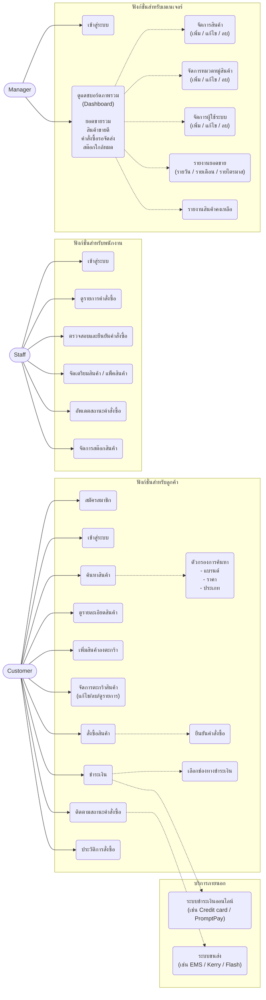
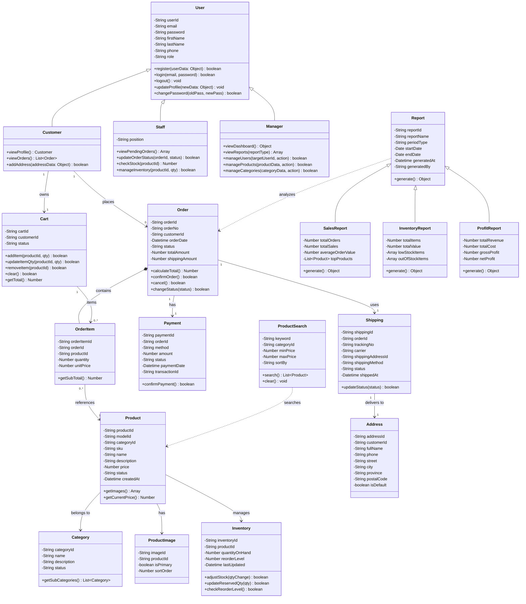
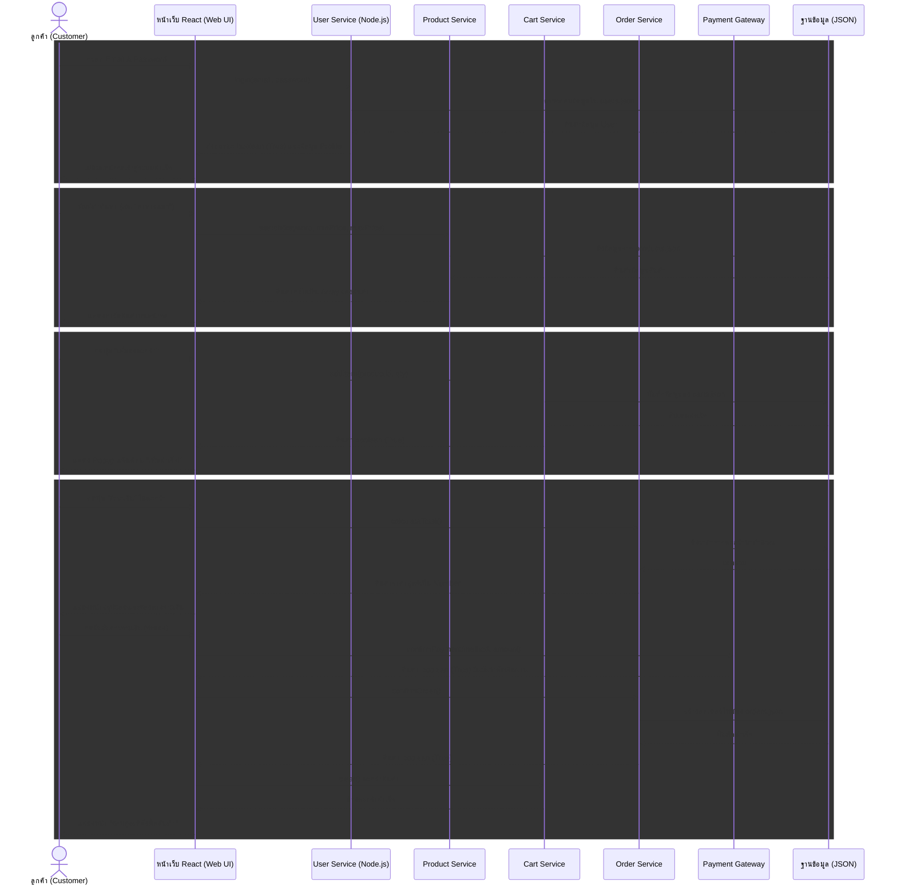
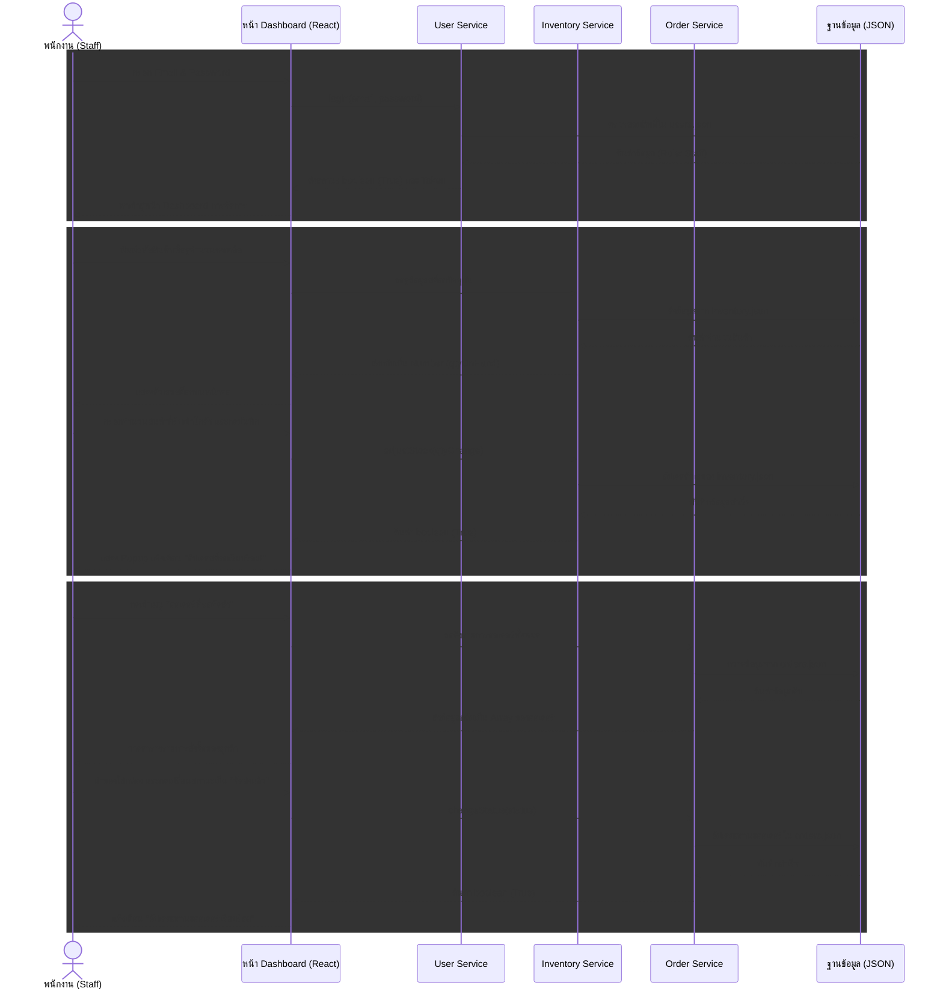
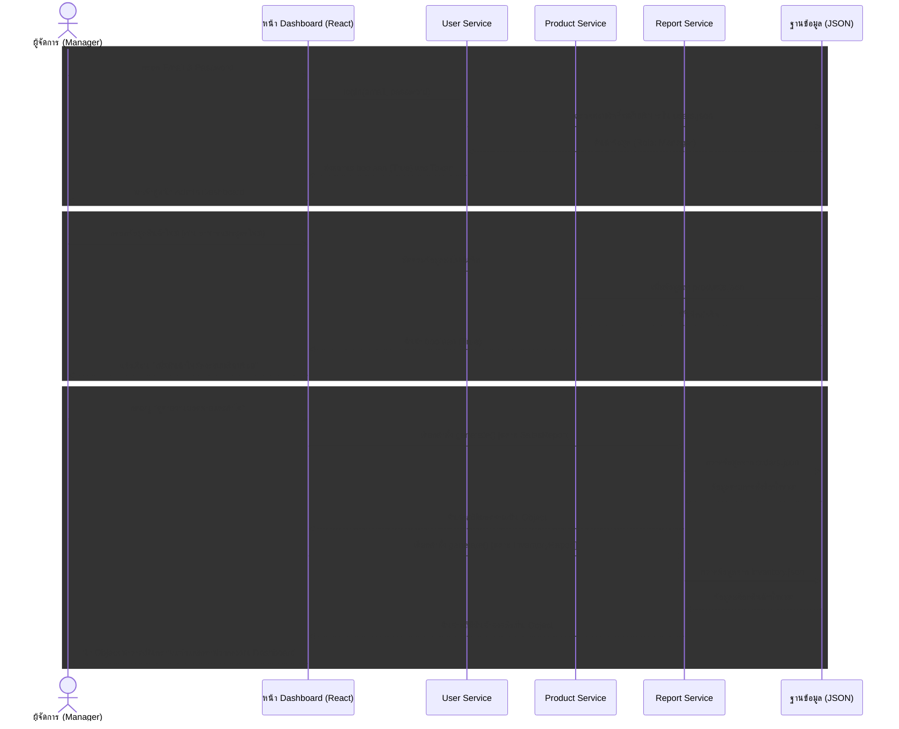
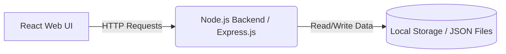

# PetStop (เพ็ทสต็อป)
**Domain:** e-Commerce (ระบบร้านค้าออนไลน์สำหรับสัตว์เลี้ยงแบบครบวงจร)

## 📑 สารบัญ (Table of Contents)
1. [สมาชิกในกลุ่ม (Group Members)](#group-members)
2. [หลักการและเหตุผล (Rationale)](#rationale)
3. [วัตถุประสงค์ของโครงงาน (Objectives)](#objectives)
4. [ขอบเขตของระบบ (System Scope)](#system-scope)
5. [แนวทางของการพัฒนาตาม SDLC (System Development Life Cycle)](#system-development-life-cycle)
6. [User Personas (กลุ่มผู้ใช้งานเป้าหมาย)](#user-personas)
7. [UI/UX Design & Prototype](#ui-ux)
8. [Tech Stack (เครื่องมือและเทคโนโลยีที่ใช้)](#tech-stack)
9. [แผนการดำเนินงาน (Work Plan)](#work-plan)
10. [Use Case Diagram](#use-case)
11. [Class Diagram](#class-diagram)
12. [Sequence Diagrams](#sequence-diagrams)
13. [System Architecture](#system-architecture)
14. [Wireframe](#wireframe)
15. [Data Schema](#data-schema)

---

## 👥 สมาชิกในกลุ่ม (Group Members)
* **67097950** อนันยศ ชัยชนะ (ปลานัย) - Project Manager, Infrastructure
* **67107433** ณัชพล วงศาจันทร์ (นอร์ท) - Frontend, Backend
* **67115588** ธนกฤต เพ็ชรกำจัด (บอน) - Frontend, Backend

---

## 💡 หลักการและเหตุผล (Rationale)
ในปัจจุบัน ผู้คนนิยมเลี้ยงสัตว์เลี้ยงเพื่อเป็นเพื่อนคลายเหงามากขึ้น อย่างไรก็ตามผู้เลี้ยงสัตว์จำนวนมากมักประสบปัญหาข้อจำกัดด้านเวลาในการเดินทางไปซื้อสินค้าที่ร้านค้าโดยตรง หรือร้านค้าในพื้นที่อาจมีสินค้าไม่ครอบคลุมความต้องการ จากปัญหาดังกล่าว จึงมีแนวคิดที่จะพัฒนาเว็บไซต์สำหรับสินค้าพื้นฐานแบบครบวงจร

---

## 🎯 วัตถุประสงค์ของโครงงาน (Objectives)
1. เพื่อพัฒนาเว็บไซต์ที่เป็นศูนย์รวมสินค้าและอุปกรณ์สำหรับสัตว์เลี้ยงครบวงจร
2. เพื่อพัฒนาระบบจัดการข้อมูลสินค้าและระบบค้นหาที่ช่วยให้ผู้ใช้งานสามารถหาสินค้าที่ต้องการได้อย่างรวดเร็ว
3. เพื่ออำนวยความสะดวกและเพิ่มช่องทางในการเลือกสินค้าสำหรับสัตว์เลี้ยงให้แก่ผู้บริโภค

---

## ⚙️ ขอบเขตของระบบ (System Scope)

### ผู้ใช้งาน (Actors)
* ลูกค้า (Customer)
* พนักงาน (Staff)
* ผู้จัดการ (Manager / Admin)

### ความสามารถหลักของระบบ (Main Functions)
1. การจัดการสมาชิก (Register / Login)
2. การจัดการข้อมูลสินค้า (Product Management)
3. การค้นหาและแสดงรายละเอียดสินค้า (Search & View Products)
4. ระบบตะกร้าสินค้า (Shopping Cart)
5. ระบบสั่งซื้อสินค้า (Order Management)
6. ระบบชำระเงิน (Simulation หรือ Mockup ได้)
7. ระบบติดตามสถานะคำสั่งซื้อ 
8. ระบบจัดการสินค้าและคำสั่งซื้อสำหรับผู้ดูแลระบบ
9. รานงานหรือ Dashboard สรุปข้อมูลเบื้องต้น

---

## 🧑‍💻 แนวทางของการพัฒนาตาม SDLC (System Development Life Cycle)

| ขั้นตอน (Phase) | รายละเอียดโดยย่อ (Brief Description) |
| :--- | :--- |
| **1. Planning** | กำหนดเป้าหมาย ขอบเขตการทำงานของเว็บ วางแผนระยะเวลา และแบ่งหน้าที่ในทีม |
| **2. Analysis** | วิเคราะห์ความต้องการโดยอิงจาก Persona, Usecase & Class Diagram |
| **3. Design** | ออกแบบ Frontend ด้วย Figma ออกแบบ Backend ด้วย System Architecture |
| **4. Development** | เขียนโค้ดสร้างระบบ ฐานข้อมูล ตามที่วิเคราะห์ |
| **5. Testing** | ทดสอบเครื่องมือต่างๆ และ ทดสอบด้วยมือ |
| **6. Deployment** | นำโค้ดขึ้น Production เพื่อเปิดให้ผู้ใช้งานจริงสามารถเข้าถึงได้ |
| **7. Maintenance** | ติดตามดูแลระบบ แก้ไขปัญหาที่เกิดขึ้นหลังจากการเปิดใช้งาน |

---

## 🧑‍🤝‍🧑 User Personas (กลุ่มผู้ใช้งานเป้าหมาย)

### 1. ลูกค้า (Customer) - คุณ มิยาบิ 
* **อายุ:** 32 ปี | **อาชีพ:** พนักงานบริษัท | **รายได้:** 35,000 บาท/เดือน
* **ความสนใจ:** สุขภาพสัตว์เลี้ยง, ของเล่นและเสื้อผ้าตามเทรนด์, ความสะดวกสบายในการช้อปปิ้ง
* **เป้าหมาย:** ต้องการซื้อของให้สัตว์เลี้ยงครบจบในเว็บเดียว และสามารถค้นหาสินค้าที่ตรงกับความต้องการได้อย่างรวดเร็วผ่านตัวกรอง ราคา, ประเภท และสินค้าขายดี
* **ความต้องการ:** ระบบค้นหาสินค้าที่แม่นยำและแสดงรายละเอียดสินค้าชัดเจน, ช่องทางการชำระเงินที่สะดวกรองรับทั้งระบบออนไลน์ (Credit card / PromptPay),  สามารถติดตามสถานะคำสั่งซื้อและดูประวัติการสั่งซื้อย้อนหลังได้ด้วยตัวเอง
* **Pain Point:** หาสินค้าเฉพาะเจาะจงยาก เสียเวลาเข้าหลายเว็บ, ไม่มั่นใจรายละเอียดสินค้าก่อนซื้อ, และเว็บทั่วไปมักมีช่องทางการชำระเงินที่จำกัดหรือยุ่งยาก

### 2. พนักงาน (Staff) - คุณ ชาย
* **อายุ:** 25 ปี | **อาชีพ:** พนักงานรับออเดอร์ | **รายได้:** 23,000 บาท/เดือน
* **ความสนใจ:** ารจัดระเบียบสินค้า, การบริการลูกค้า, ความรวดเร็วในการทำงาน
* **เป้าหมาย:** จัดเตรียมสินค้าและแพ็กตามออเดอร์ได้อย่างถูกต้อง รวดเร็ว พร้อมทั้งอัปเดตสถานะให้ลูกค้าทราบได้ทันที
* **ความต้องการ:** ระบบที่สามารถดึงรายการออเดอร์ทั้งหมดมาดูเพื่อตรวจสอบและยืนยันคำสั่งซื้อได้ง่าย, สามารถกดยืนยันการอัปเดตสถานะเป็น "จัดส่งแล้ว" เข้าสู่ระบบฐานข้อมูล (orders.json) ได้ทันที, ระบบตรวจสอบและปรับปรุงสต็อก ที่ใช้งานง่ายและอัปเดตจำนวนสินค้าลงฐานข้อมูลได้รวดเร็ว
* **Pain Point:** ลูกค้าสั่งของที่หมดไปแล้วเพราะระบบตัดสต็อกไม่ทัน, สับสนกับรายการออเดอร์ที่ต้องจัดส่งเพราะไม่มีระบบจัดการสถานะที่ชัดเจน

### 3. ผู้จัดการ (Admin) - คุณ เดโช
* **อายุ:** 45 ปี | **อาชีพ:** เจ้าของร้าน All-in-one Pet Store | **รายได้:** 50,000 บาท/เดือน
* **ความสนใจ:** การบริหารคลังสินค้า, การวิเคราะห์ยอดขายเพื่อทำกำไร, พฤติกรรมคนรักสัตว์
* **เป้าหมาย:** บริหารจัดการสต็อกให้มีประสิทธิภาพสูงสุด และวิเคราะห์ข้อมูลภาพรวมของร้านเพื่อประกอบการตัดสินใจทางธุรกิจ
* **ความต้องการ:** หน้า Dashboard ที่แสดงภาพรวมทั้งหมด เช่น ยอดขายรวม, สินค้าขายดี, คำสั่งซื้อรอจัดส่ง และแจ้งเตือนสินค้าสต็อกใกล้หมด, ระบบจัดการแคตตาล็อกสินค้าที่สามารถ เพิ่ม แก้ไข และลบข้อมูลหมวดหมู่หรือตัวสินค้าได้ด้วยตนเอง, ระบบที่สามารถดึงข้อมูลมาสร้างรายงาน ทั้งรายงานยอดขาย (รายวัน/รายเดือน/รายไตรมาส), รายงานสินค้าคงเหลือ และรายงานผลประกอบการ โดยแสดงผลเป็นกราฟแท่งหรือกราฟวงกลมบนหน้าเว็บได้
* **Pain Point:** จำนวน SKU สินค้าเยอะมากทำให้คุมสต็อกด้วยมือยากและเกิดข้อผิดพลาด, ขาดข้อมูลสรุปยอดขายและกำไรที่เป็นรูปธรรมทำให้วางแผนธุรกิจได้ลำบาก
---

## 🎨 UI/UX Design & Prototype

### Color Palette (โทนสีที่ใช้)
* 🟩 `#CCD5AE` (สีเขียวอ่อน)
* 🟨 `#E0E5B6` (สีเหลืองมะนาวอ่อน)
* 🟧 `#FAEDCE` (สีครีมอ่อน)
* 🟨 `#FEFAE0` (สีเหลืองพาสเทล)

### Typography (แบบอักษร)
* **Font Family:** Promt

---

## 🧰 Tech Stack (เครื่องมือและเทคโนโลยีที่ใช้)

| หมวด | เทคโนโลยี | รายละเอียด |
| :--- | :--- | :--- |
| **Frontend** | React, HTML/CSS/JavaScript | พัฒนาส่วนแสดงผลและโต้ตอบกับผู้ใช้งาน |
| **Backend** | Node.js (Express.js) | จัดการระบบหลังบ้านและสร้าง API |
| **Database** | Local Storage (JSON) | ใช้เป็นที่จัดเก็บข้อมูลจำลองของระบบ |
| **Design** | Figma | ออกแบบ UI/UX และ Prototype |
| **Version Control** | Git, GitHub | จัดการการเปลี่ยนแปลงของโค้ดและทำงานร่วมกัน |

---

## 📅 แผนการดำเนินงาน (Work Plan: 4 Weeks)
| สัปดาห์ที่ (Week) | กิจกรรม (Activities) | รายละเอียดโดยย่อ (Brief Description) |
| :---: | :--- | :--- |
| **1** | **วิเคราะห์และออกแบบระบบ (Analysis & Design)** | รวบรวมความต้องการ วิเคราะห์ระบบและออกแบบโดยอิงจาก Persona, Usecase & Class Diagram ผ่านทาง Figma และตัว Wireframe |
| **2** | **พัฒนา Frontend (Frontend Development)** | UI/UX ที่ผู้ใช้สามารถเข้าใจและใช้งานง่าย ไปรับเชื่อมโดยจะมีพื้นฐานอย่าง Login, Product, Product Detail และ Payment |
| **3** | **พัฒนา Backend และฐานข้อมูล (Backend & Database Development)** | เชื่อมต่อ API ให้ตรงกับตัวของ Frontend แล้วก็เชื่อมโดยใช้ CORS และ Express.js |
| **4** | **ทดสอบระบบและนำเสนอผลงาน (Testing & Presentation)** | ตรวจสอบหาข้อผิดพลาดของระบบ (Bugs) ปรับปรุงแก้ไข และเตรียมเอกสารสำหรับนำเสนอโครงงาน |

---

## 🗝️ Use Case Diagram

---

## ⚙️ Class Diagram

---

## 🔧 Sequence Diagrams

1.Customer

2.Staff

3.Manager

---

## 🏗 System Architecture

---

### 🎯 Wireframe / Prototype - [Click to inspect](https://www.figma.com/design/By0aa0Ia9NAwNOilaYCD85/PetStop?node-id=87-393&p=f&t=l2h7526gFYC8L37D-0)

---

## 🗄️ Data Schema (JSON Database)

ระบบ PetStop ใช้การจัดเก็บข้อมูลในรูปแบบไฟล์ JSON (Local Storage) โดยแบ่ง Collection หลักๆ ออกตาม Entity ดังนี้:

#### 1. `inventory.json` (ข้อมูลคลังสินค้า)
ไฟล์นี้ใช้สำหรับเก็บข้อมูลเชิงลึกและจำนวนสต็อกของสินค้าแต่ละรายการ

| Field Name | Type | Description (รายละเอียด) |
| :--- | :--- | :--- |
| `id` | `string` | รหัสอ้างอิงสต็อก (เช่น DG-DRY-001) |
| `sku` | `string` | รหัส SKU ของสินค้า |
| `productId` | `string` | รหัสอ้างอิงไปยัง Product Master (เช่น PD-001) |
| `name` | `string` | ชื่อสินค้า |
| `subtitle` | `string` | คำบรรยายรอง (ถ้ามี) |
| `unitLabel` | `string` | ป้ายกำกับหน่วยบรรจุภัณฑ์ |
| `category` | `string` | หมวดหมู่สินค้า |
| `supplier` | `string` | ชื่อผู้จัดจำหน่าย / ซัพพลายเออร์ |
| `stock` | `number` | จำนวนคงเหลือในสต็อก |
| `threshold` | `number` | จุดสั่งซื้อเพิ่ม (แจ้งเตือนเมื่อสต็อกต่ำ) |
| `unitCost` | `number` | ต้นทุนต่อหน่วย |
| `lastUpdated` | `string` | วันที่และเวลาที่อัปเดตล่าสุด (ISO 8601) |
| `bestSeller` | `boolean` | สถานะสินค้าขายดี (อาจไม่มีในบางรายการ) |
| `id-type` | `string` | ชนิดของไอดีหมวดหมู่ (เช่น dogs, cats, accessories) |
| `specifications` | `object` | ข้อมูลจำเพาะของสินค้า (แบรนด์, ส่วนผสม, ขนาด, ฯลฯ) |
| `image` | `string` | URL รูปภาพสินค้า |
| `careInstructions` | `array` | คำแนะนำการเก็บรักษา (ถ้ามี) |
| `lastAdjustment` | `object` | ประวัติการปรับสต็อกครั้งล่าสุด (ประเภท, จำนวน, เหตุผล) |

#### 2. `order.json` (ข้อมูลคำสั่งซื้อ)
ไฟล์นี้เก็บข้อมูลธุรกรรมการสั่งซื้อของลูกค้า การจัดส่ง และการชำระเงิน

| Field Name | Type | Description (รายละเอียด) |
| :--- | :--- | :--- |
| `orderId` | `string` | รหัสคำสั่งซื้อ (เช่น ORD-1001) |
| `orderNo` | `string` | เลขที่อ้างอิงคำสั่งซื้อ |
| `customerId` | `string` | รหัสลูกค้า (อ้างอิงจาก Users) |
| `orderDate` | `string` | วันที่และเวลาที่สั่งซื้อ (ISO 8601) |
| `status` | `string` | สถานะคำสั่งซื้อปัจจุบัน (เช่น Delivered) |
| `statusHistory` | `array` | ประวัติการเปลี่ยนสถานะของคำสั่งซื้อ |
| `subtotal` | `number` | ยอดรวมราคาสินค้า |
| `shippingAmount` | `number` | ค่าจัดส่ง |
| `taxAmount` | `number` | จำนวนภาษี |
| `totalAmount` | `number` | ยอดรวมสุทธิที่ต้องชำระ |
| `items` | `array` | รายการสินค้าในคำสั่งซื้อ (productId, ชื่อ, จำนวน, ราคา, ฯลฯ) |
| `shippingAddress`| `object` | ข้อมูลที่อยู่สำหรับการจัดส่ง |
| `shipping` | `object` | รายละเอียดวิธีจัดส่ง ขนส่ง และหมายเลขพัสดุ |
| `payment` | `object` | รายละเอียดการชำระเงิน (วิธี, ยอดเงิน, สถานะ, transactionId) |

#### 3. `product.json` (ข้อมูลหลักของสินค้า)
ไฟล์นี้เป็น Master Data เก็บข้อมูลเบื้องต้นของสินค้าสำหรับใช้แสดงหน้าร้าน

| Field Name | Type | Description (รายละเอียด) |
| :--- | :--- | :--- |
| `productId` | `string` | รหัสสินค้า (ใช้อ้างอิงไปยัง Inventory) |
| `name` | `string` | ชื่อสินค้า |
| `description` | `string` | คำอธิบายสินค้า |
| `price` | `number` | ราคาขายหน้าร้าน |
| `category` | `string` | หมวดหมู่สินค้า |
| `status` | `string` | สถานะของสินค้า (เช่น Active) |
| `imageUrl` | `string` | URL รูปภาพสินค้า (ถ้ามี) |

#### 4. `purchaseOrders.json` (ใบสั่งซื้อสินค้าเข้าสต็อก)
ไฟล์นี้ใช้บันทึกข้อมูลการสั่งซื้อของเข้ามาเติมในคลังสินค้า

| Field Name | Type | Description (รายละเอียด) |
| :--- | :--- | :--- |
| `id` | `string` | รหัสใบสั่งซื้อ/ใบรับสินค้าเข้าสต็อก (เช่น PO-8821) |
| `createdAt` | `string` | วันที่และเวลาที่สร้างรายการรับเข้า (ISO 8601) |
| `status` | `string` | สถานะการรับของ (เช่น Received) |
| `items` | `array` | รายการสินค้าที่รับเข้า (id, ชื่อ, จำนวนที่รับเข้า, ต้นทุนต่อหน่วย) |
| `receivedAt` | `string` | วันที่และเวลาที่ได้รับสินค้าจริง (ISO 8601) |

#### 5. `user.json` (ข้อมูลผู้ใช้งานระบบ)
ไฟล์นี้เก็บข้อมูลของผู้ใช้งานทั้งหมด ทั้งลูกค้า (Customer), พนักงาน (Staff) และผู้จัดการ (Manager)

| Field Name | Type | Description (รายละเอียด) |
| :--- | :--- | :--- |
| `id` | `string` | รหัสผู้ใช้งานระบบ (เช่น PS0001, CPS0001) |
| `prefix` | `string` | คำนำหน้าชื่อ (มีเฉพาะพนักงาน) |
| `firstName` | `string` | ชื่อจริง |
| `lastName` | `string` | นามสกุล |
| `email` | `string` | อีเมลสำหรับการล็อกอินและติดต่อ |
| `phone` | `string` | เบอร์โทรศัพท์ |
| `password` | `string` | รหัสผ่าน |
| `role` | `string` | บทบาทในระบบ (Manager, Staff, Customer) |
| `status` | `string` | สถานะบัญชีผู้ใช้ (เช่น ACTIVE, LEAVE) |
| `idCard` | `string` | เลขบัตรประจำตัวประชาชน (เฉพาะพนักงาน) |
| `bloodGroup` | `string` | กรุ๊ปเลือด (เฉพาะพนักงาน) |
| `profileImage` | `string` | URL รูปโปรไฟล์ |
| `emergencyContact` | `object` | ข้อมูลผู้ติดต่อฉุกเฉิน (ชื่อ, เบอร์, ความสัมพันธ์) (เฉพาะพนักงาน) |
| `addresses` | `array` | รายการที่อยู่ (เฉพาะลูกค้า) |

---
