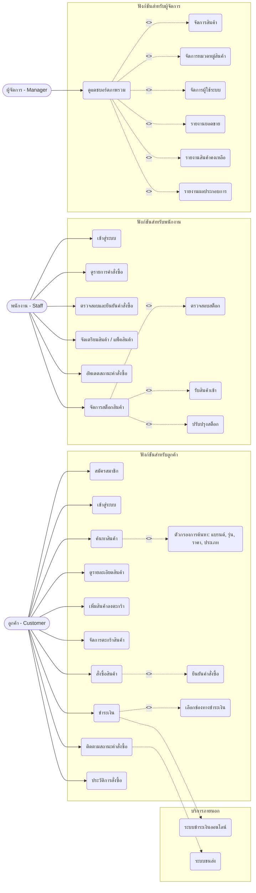
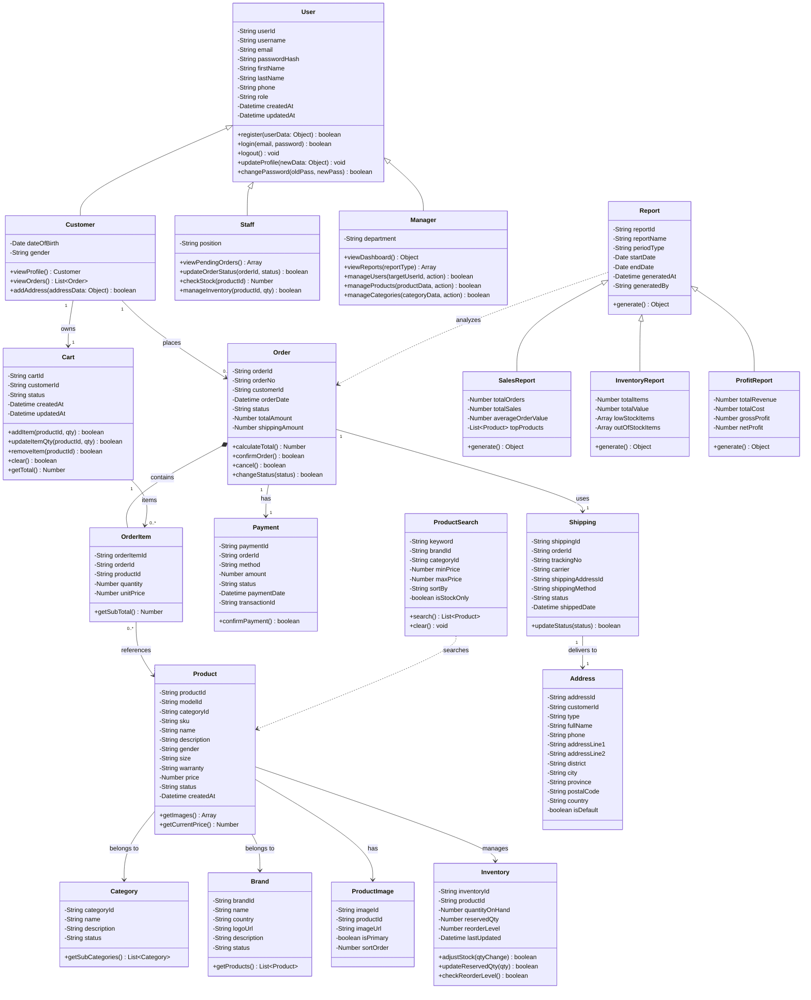
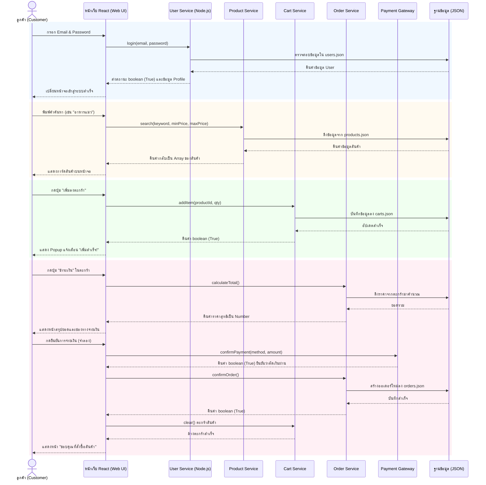
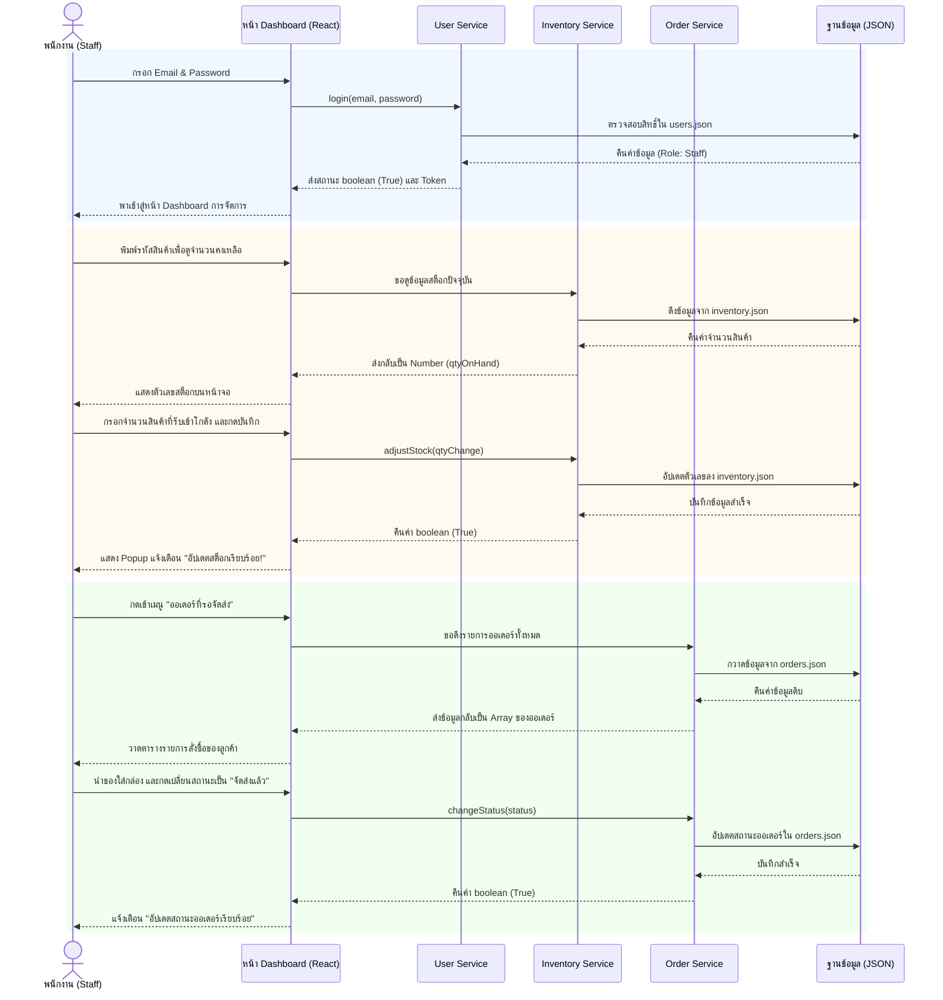
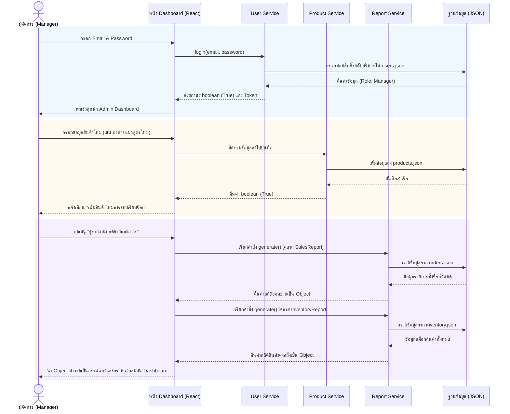
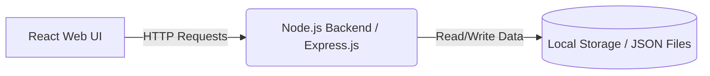

# PetStop (เพ็ทสต็อป)
**Domain:** e-Commerce (ระบบร้านค้าออนไลน์สำหรับสัตว์เลี้ยงแบบครบวงจร)

## 📑 สารบัญ (Table of Contents)
1. [สมาชิกในกลุ่ม (Group Members)](#group-members)
2. [หลักการและเหตุผล (Rationale)](#rationale)
3. [วัตถุประสงค์ของโครงงาน (Objectives)](#objectives)
4. [ขอบเขตของระบบ (System Scope)](#system-scope)
5. [User Personas (กลุ่มผู้ใช้งานเป้าหมาย)](#user-personas)
6. [UI/UX Design & Prototype](#ui-ux)
7. [Tech Stack (เครื่องมือและเทคโนโลยีที่ใช้)](#tech-stack)
8. [แผนการดำเนินงาน (Work Plan)](#work-plan)
9. [Use Case Diagram](#use-case)
10. [Class Diagram](#class-diagram)
11. [Sequence Diagrams](#sequence-diagrams)
12. [System Architecture](#system-architecture)

---

## 👥 สมาชิกในกลุ่ม (Group Members)
* **67097950** อนันยศ ชัยชนะ (ปลานัย) - Project Manager, Infrastructure
* **67107433** ณัชพล วงศาจันทร์ (บอน) - Frontend, Backend
* **67115588** ธนกฤต เพ็ชรกำจัด (พี่นอร์ท) - Frontend, Backend

---

## 💡 หลักการและเหตุผล (Rationale)
ในปัจจุบัน ผู้คนนิยมเลี้ยงสัตว์เลี้ยงเพื่อเป็นเพื่อนคลายเหงามากขึ้น อย่างไรก็ตามผู้เลี้ยงสัตว์จำนวนมากมักประสบปัญหาข้อจำกัดด้านเวลาในการเดินทางไปซื้อสินค้าที่ร้านค้าโดยตรง หรือร้านค้าในพื้นที่อาจมีสินค้าไม่ครอบคลุมความต้องการ จากปัญหาดังกล่าว จึงมีแนวคิดที่จะพัฒนาเว็บไซต์สำหรับสินค้าพื้นฐานแบบครบวงจร

---

## 🎯 วัตถุประสงค์ของโครงงาน (Objectives)
1. เพื่อพัฒนาเว็บไซต์ที่เป็นศูนย์รวมสินค้าและอุปกรณ์สำหรับสัตว์เลี้ยงครบวงจร
2. เพื่อพัฒนาระบบจัดการข้อมูลสินค้าและระบบค้นหาที่ช่วยให้ผู้ใช้งานสามารถหาสินค้าที่ต้องการได้อย่างรวดเร็ว
3. เพื่ออำนวยความสะดวกและเพิ่มช่องทางในการเลือกสินค้าสำหรับสัตว์เลี้ยงให้แก่ผู้บริโภค

---

## ⚙️ ขอบเขตของระบบ (System Scope)

### ผู้ใช้งาน (Actors)
* ลูกค้า (Customer)
* พนักงาน (Staff)
* ผู้จัดการ (Manager / Admin)

### ความสามารถหลักของระบบ (Main Functions)
1. การจัดการสมาชิก (Register / Login)
2. การจัดการข้อมูลสินค้า (Product Management)
3. การค้นหาและแสดงรายละเอียดสินค้า (Search & View Products)
4. ระบบตะกร้าสินค้า (Shopping Cart)
5. ระบบสั่งซื้อสินค้า (Order Management)

---

## 🧑‍🤝‍🧑 User Personas (กลุ่มผู้ใช้งานเป้าหมาย)

### 1. ลูกค้า (Customer) - คุณสมชาย ใจดี
* **อายุ:** 32 ปี | **อาชีพ:** พนักงานบริษัท | **รายได้:** 35,000 บาท/เดือน
* **ความสนใจ:** สุขภาพสัตว์เลี้ยง, ของเล่นและเสื้อผ้าตามเทรนด์, ความสะดวกสบายในการช้อปปิ้ง
* **เป้าหมาย:** ต้องการซื้อของให้สัตว์เลี้ยงครบจบในเว็บเดียว ไม่ต้องแยกซื้อหลายร้าน และหาสินค้าที่ตรงกับสายพันธุ์/ช่วงวัยได้อย่างรวดเร็ว
* **ความต้องการ:** ระบบค้นหาที่ใช้งานง่าย (แยกหมวดหมา-แมวชัดเจน), ข้อมูลสินค้าละเอียด, ระบบชำระเงินที่ปลอดภัยและรวดเร็ว
* **Pain Point:** หาสินค้าเฉพาะเจาะจงยาก (เช่น อาหารแมวแต่มีอาหารหมาปนมา), ไม่มั่นใจไซส์เสื้อผ้า/ปลอกคอ, เสียเวลาเข้าหลายเว็บเพื่อซื้อของให้สัตว์หลายชนิด

### 2. พนักงาน (Staff) - คุณหญิง ใจดี
* **อายุ:** 25 ปี | **อาชีพ:** พนักงานรับออเดอร์ | **รายได้:** 18,000 บาท/เดือน
* **ความสนใจ:** การจัดระเบียบสินค้า, การบริการลูกค้า
* **เป้าหมาย:** จัดเตรียมสินค้าตามออเดอร์ให้รวดเร็ว ถูกต้อง (ไม่ผิดไซส์/รสชาติ) และให้คำแนะนำลูกค้าได้อย่างแม่นยำ
* **ความต้องการ:** ระบบจัดการออเดอร์ที่ใช้งานง่าย แสดงรายการแพ็กชัดเจน และระบบค้นหาสต็อกที่รวดเร็ว
* **Pain Point:** สินค้ามีรายละเอียดจุกจิกเยอะทำให้หยิบผิดง่าย, ลูกค้าทักมาถามหาสินค้าที่หมดไปแล้วทำให้เสียเวลาเช็ก

### 3. ผู้จัดการ (Admin) - คุณเดชา วิสัยทัศน์
* **อายุ:** 45 ปี | **อาชีพ:** เจ้าของร้าน All-in-one Pet Store | **รายได้:** 70,000 บาท/เดือน
* **ความสนใจ:** การบริหารคลังสินค้า, การวิเคราะห์ยอดขาย, พฤติกรรมคนรักสัตว์
* **เป้าหมาย:** บริหารจัดการสต็อกให้มีประสิทธิภาพสูงสุด และวิเคราะห์ข้อมูลเพื่อดูว่าสินค้าหมวดหมู่ไหนขายดีกว่ากัน
* **ความต้องการ:** ระบบจัดการสินค้าครบวงจร (เพิ่ม/แก้ไข/ลบ), ระบบรายงานสรุปยอดขายแยกตามหมวดหมู่ และรายงานสินค้าคงเหลือ
* **Pain Point:** จัดการสินค้าที่มีวันหมดอายุยาก (อาหารเปียก, ขนม), จำนวน SKU เยอะมากทำให้คุมสต็อกด้วยมือ (Manual) ได้ยาก

---

## 🎨 UI/UX Design & Prototype

🔗 **Figma Prototype:** [คลิกเพื่อดูการออกแบบ PetStop บน Figma](https://www.figma.com/design/By0aa0Ia9NAwNOilaYCD85/PetStop?node-id=135-411&t=6x1Jdpxown9icMEu-1)

### Color Palette (โทนสีที่ใช้)
* 🟩 `#CCD5AE` (สีเขียวอ่อน)
* 🟨 `#E0E5B6` (สีเหลืองมะนาวอ่อน)
* 🟧 `#FAEDCE` (สีครีมอ่อน)
* 🟨 `#FEFAE0` (สีเหลืองพาสเทล)

### Typography (แบบอักษร)
* **Font Family:** Promt

---

## 🧰 Tech Stack (เครื่องมือและเทคโนโลยีที่ใช้)

| หมวด | เทคโนโลยี | รายละเอียด |
| :--- | :--- | :--- |
| **Frontend** | React, HTML/CSS/JavaScript | พัฒนาส่วนแสดงผลและโต้ตอบกับผู้ใช้งาน |
| **Backend** | Node.js (Express.js) | จัดการระบบหลังบ้านและสร้าง API |
| **Database** | Local Storage (JSON) | ใช้เป็นที่จัดเก็บข้อมูลจำลองของระบบ |
| **Design** | Figma | ออกแบบ UI/UX และ Prototype |
| **Version Control** | Git, GitHub | จัดการการเปลี่ยนแปลงของโค้ดและทำงานร่วมกัน |

---

## 📅 แผนการดำเนินงาน (Work Plan: 4 Weeks)
| สัปดาห์ที่ (Week) | กิจกรรม (Activities) | รายละเอียดโดยย่อ (Brief Description) |
| :---: | :--- | :--- |
| **1** | **วิเคราะห์และออกแบบระบบ (Analysis & Design)** | รวบรวมความต้องการ วิเคราะห์ระบบและออกแบบโดยอิงจาก Persona, Usecase & Class Diagram ผ่านทาง Figma และตัว Wireframe |
| **2** | **พัฒนา Frontend (Frontend Development)** | UI/UX ที่ผู้ใช้สามารถเข้าใจและใช้งานง่าย ไปรับเชื่อมโดยจะมีพื้นฐานอย่าง Login, Product, Product Detail และ Payment |
| **3** | **พัฒนา Backend และฐานข้อมูล (Backend & Database Development)** | เชื่อมต่อ API ให้ตรงกับตัวของ Frontend แล้วก็เชื่อมโดยใช้ CORS และ Express.js |
| **4** | **ทดสอบระบบและนำเสนอผลงาน (Testing & Presentation)** | ตรวจสอบหาข้อผิดพลาดของระบบ (Bugs) ปรับปรุงแก้ไข และเตรียมเอกสารสำหรับนำเสนอโครงงาน |

---

## 🗝️ Use Case Diagram

---

## ⚙️ Class Diagram

---

## 🔧 Sequence Diagrams

1.Customer

2.Staff

3.Manager

---

## 🏗 System Architecture

---